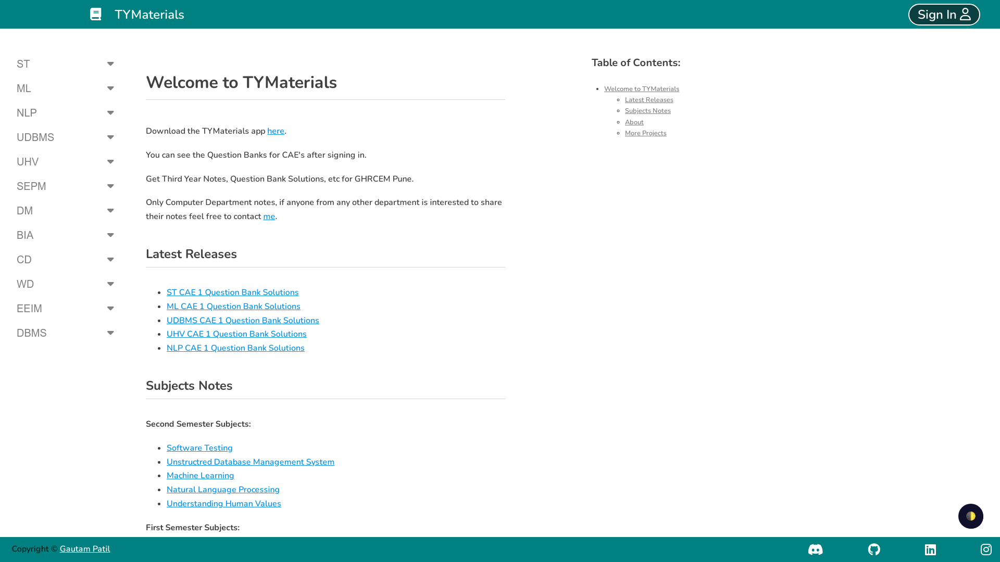
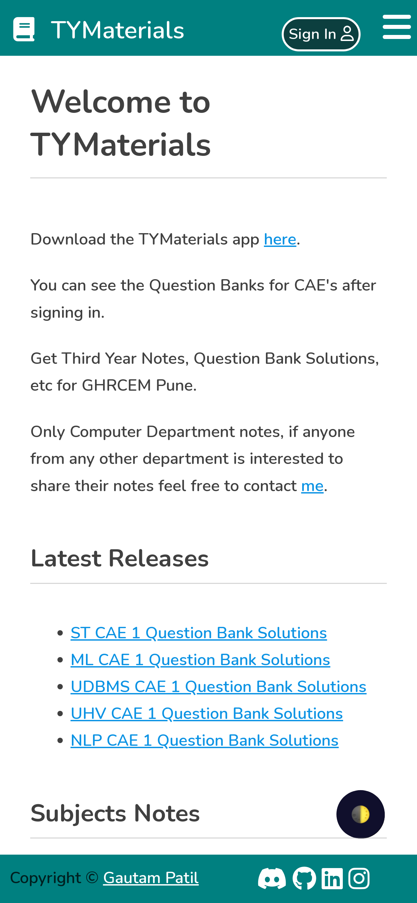

# EduMaterials

EduMaterials is an Documentation Template with Authentication
Created for [TYMaterials](https://tymaterials.live) Webstite

- Responsive Material UI
- Documentation
- Automatic Table of Contents
- Authentication Functionality with Firebase Auth
- Dynamic Sidebar
- Dark Mode Accessibility
- PostgreSQL

## Local Installation

Follow these steps to install and run the project locally:

1. Clone the repository to your local machine using `git clone https://github.com/GautamPatil1/EduMaterials`.

2. Navigate to the project directory using `cd EduMaterials`.

3. Install the necessary dependencies. If you're using npm, run `npm install`. If you're using yarn, run `yarn`.

4. Set up your Firebase and PostgreSQL configurations. You'll need to replace the placeholders in the `firebase.json` and the PostgreSQL connection string with your actual configuration details.

5. Once the setup is complete, start the server. If you're using npm, run `npm start`. If you're using yarn, run `yarn start`.

6. Open your browser and navigate to `http://localhost:3000` (or whatever port you've configured) to see the application running.

## Contributing

Contributions are welcome!

## License

This project is licensed under the terms of the MIT license. See the [LICENSE](LICENSE.md) file for details.
